# Industrial cibersecurity laboratory deployment for ICS device virtualization and ciberattack testing

- [Industrial cibersecurity laboratory deployment for ICS device virtualization and ciberattack testing](#industrial-cibersecurity-laboratory-deployment-for-ics-device-virtualization-and-ciberattack-testing)
  - [Description](#description)
  - [Requirements](#requirements)
  - [Getting Started](#getting-started)
    - [Getting Started OpenPLC](#getting-started-openplc)
      - [Create your own OpenPLC image](#create-your-own-openplc-image)
      - [Use the OpenPLC image created for the project](#use-the-openplc-image-created-for-the-project)
      - [Follow this recommendation [Only for Modbus]](#follow-this-recommendation-only-for-modbus)
    - [Getting Started Matlab](#getting-started-matlab)
      - [Create your own Matlab Simulink Docker image](#create-your-own-matlab-simulink-docker-image)
      - [Use the matlab simulink image created for the project](#use-the-matlab-simulink-image-created-for-the-project)
      - [Troubleshootings Matlab on Docker](#troubleshootings-matlab-on-docker)
      - [Import Project Files into the PATH before start simulation](#import-project-files-into-the-path-before-start-simulation)
      - [Compile all `*.c` using mex compiler of Matlab](#compile-all-c-using-mex-compiler-of-matlab)
      - [Run Simulink Project](#run-simulink-project)
    - [Getting started Scada-LTS](#getting-started-scada-lts)
      - [Troubleshootings Scada-LTS](#troubleshootings-scada-lts)
    - [Getting Started network ICSNetwork](#getting-started-network-icsnetwork)
    - [Getting Started Attacker](#getting-started-attacker)
      - [Single Attacker](#single-attacker)
        - [Create your own Attacker Docker image](#create-your-own-attacker-docker-image)
        - [Use the attacker image created for the project](#use-the-attacker-image-created-for-the-project)
        - [Deploying Attacker](#deploying-attacker)
      - [ModTester](#modtester)
        - [Create your own ModTester Docker image](#create-your-own-modtester-docker-image)
        - [Use the modtester image created for the project](#use-the-modtester-image-created-for-the-project)
        - [Deploying ModTester](#deploying-modtester)
    - [Getting Started TCPDump](#getting-started-tcpdump)
  - [How to use the project](#how-to-use-the-project)
    - [Deploy ICSNetwork](#deploy-icsnetwork)
    - [Deploy tcpdump](#deploy-tcpdump)
    - [Deploy Attacker](#deploy-attacker)
      - [Single Attacker](#single-attacker-1)
      - [ModTester](#modtester-1)
  - [How to test connection](#how-to-test-connection)
    - [Install/use ping network tool](#installuse-ping-network-tool)

## Description

This project arises as [@jmuguruza](https://github.com/jmuguruza) final degree project and [@ndevillalon](https://github.com/ndevillalon) internship and aims to perform security tests on a water treatment plant. For this purpose, the project integrates 3 basic elements: [OpenPLC](https://github.com/thiagoralves/OpenPLC_v3), [Scada-LTS](https://github.com/SCADA-LTS/Scada-LTS) and [Matlab on Docker](https://github.com/mathworks-ref-arch/matlab-dockerfile).

**Project Status:** `in progress`

## Requirements

1. Install [docker for ubuntu](https://docs.docker.com/engine/install/ubuntu/).
2. [Manage Docker as non-root user](https://docs.docker.com/engine/install/linux-postinstall/).
   1. If it does not work try running `sudo chmod o+rw /var/run/docker.sock` after adding a new user
3. Install [docker-compose for ubuntu](https://docs.docker.com/compose/install/).
4. Install make `sudo apt install make`.
5. Install g++:
   1. `sudo apt-get update`
   2. `sudo apt-get install -y g++`

## Getting Started

### Getting Started OpenPLC

Open to see details

#### Create your own OpenPLC image  

- Build openplc image:
  - cd `~/ICSVirtual/openplc`
  - `docker build -t open-plc .`
  
#### Use the OpenPLC image created for the project

- Open docker-compose file `cd ~/ICSVirtual/network/ICSNetwork`.
- Change the image of the `openplc` service by `sflorenz05/open-plc:v0.1`.

#### Follow this recommendation [Only for Modbus]

- Once OpenPLC container is running:
  
- Disable DNP3/EtherNET/IP to use only Modbus protocol:

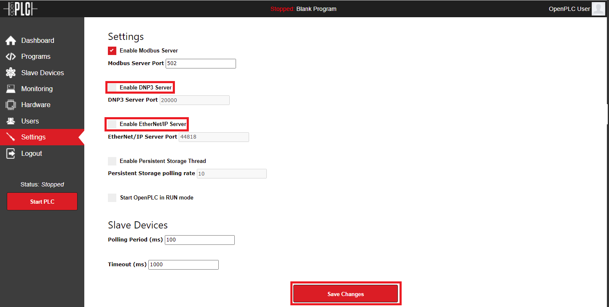

- Load the `*.st` file of the project.
  - E.g.: file `water_heater.st` is placed into `~/ICSVirtual/openplc/sample/`.
  
- Start PLC.

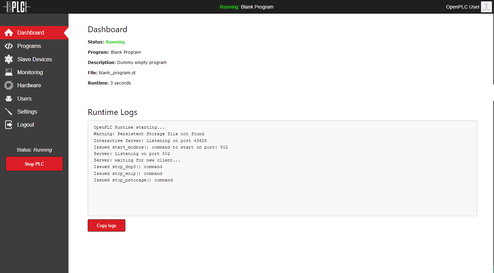

### Getting Started Matlab

Open to see details

#### Create your own Matlab Simulink Docker image

- Run the MATLAB container using this command:
      `docker run -it -p 5901:5901 -p 6080:6080 --shm-size=512M mathworks/matlab:r20XYz -vnc`

  - :r20XYz chooses the release version of the MATLAB container. E.g.: `r2022a`
  
  - Open a bash for the Matlab container: e.g.: `docker exec -it <containerID> bash`.
  
  - Run Matlab with `root` permissions: `sudo matlab`.

  - Install *Industrial Control Communication Toolbox* as add-on:

      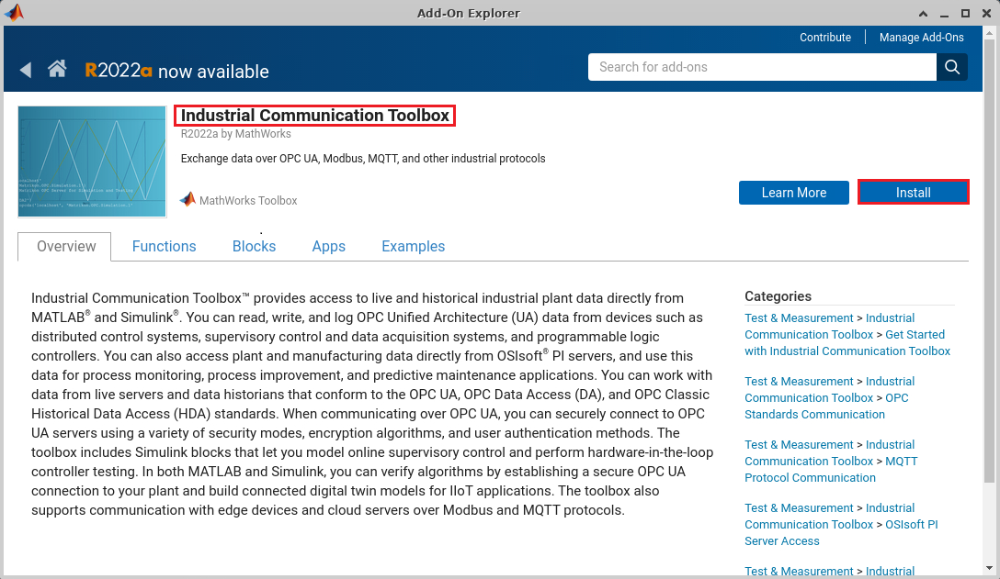

  - Install Matlab Simulink as add-on:

      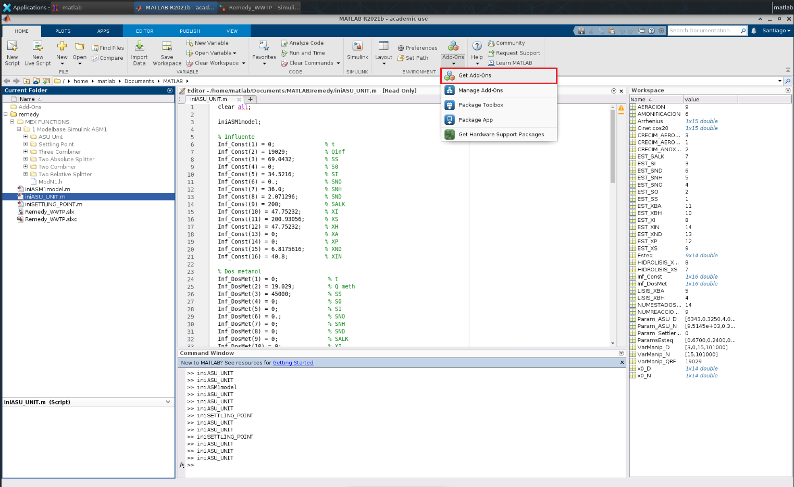

      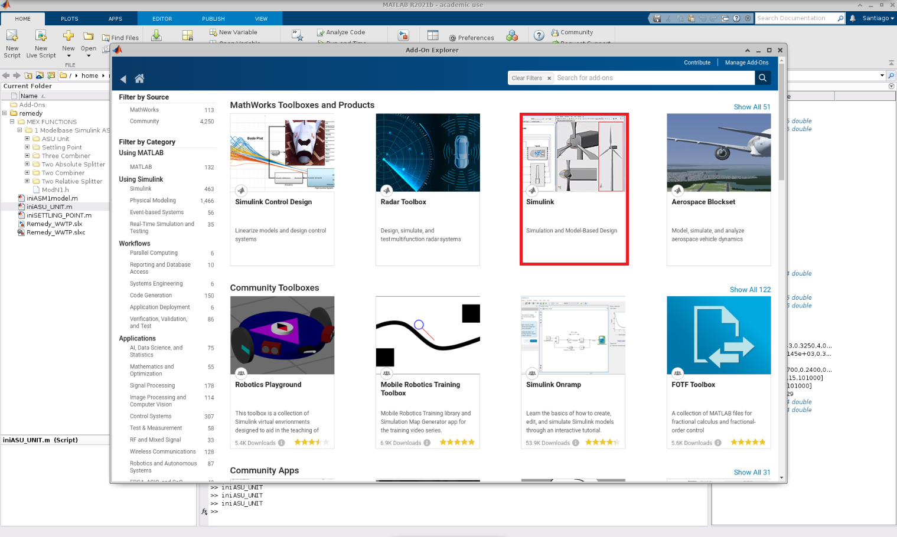

  - Install gcc, g++, foltran:
    - `sudo apt-get update`
    - `sudo apt-get install -y gcc g++ gfortran`
        
      
  
  - [Save changes in container](https://www.mathworks.com/help/cloudcenter/ug/save-changes-in-containers.html)
    - `docker ps`
    - `docker commit <containerID> <repository>:<tag>`
      - E.g.: `docker commit 3d555451f07a mymatlab:r2020a`.

#### Use the matlab simulink image created for the project

- Open docker-compose file `cd ~/ICSVirtual/network/ICSNetwork`.
- Change the image of the `matlab` service by `sflorenz05/matlab_simulink:v0.3`.
  
#### Troubleshootings Matlab on Docker

- [Matlab from docker-compose #39](https://github.com/mathworks-ref-arch/matlab-dockerfile/issues/39).
- [Installing Simulink as a Docker Matlab add-on #40](https://github.com/mathworks-ref-arch/matlab-dockerfile/issues/40).

#### Import Project Files into the PATH before start simulation

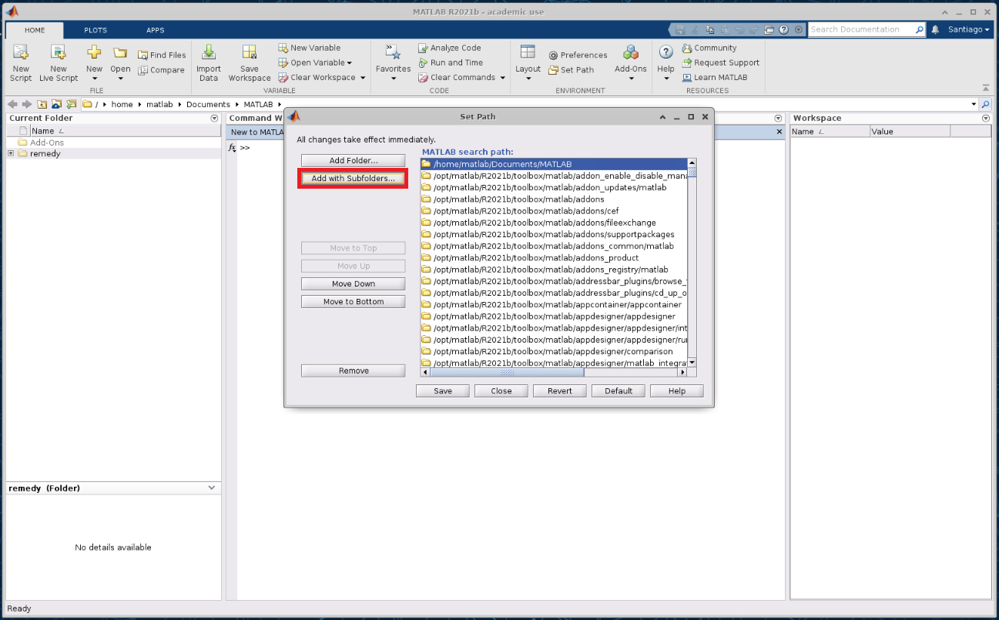

#### Compile all `*.c` using mex compiler of Matlab

- The `*.c` version of all of the following folders must be compiled using mex:
  
  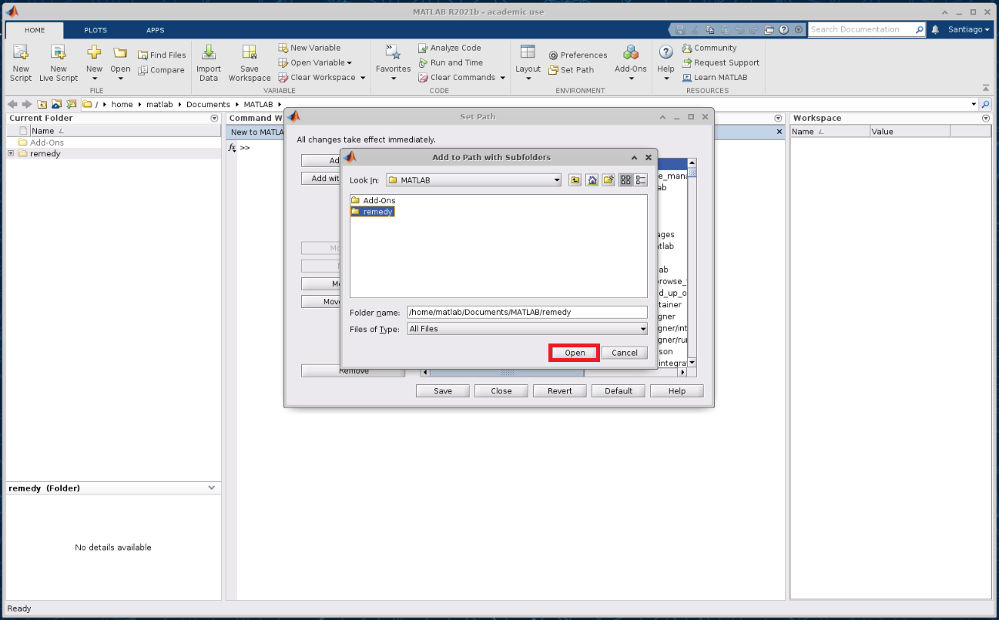

- All files has been compiled by default.
  - E.g.: If we go inside the `ASU Unit` folder (see the PATH in the following image) we only need to compile the `*.c`, using the command `mex ASU_UNIT.c`. **Important:** `*.mexa64` files are generated.
  
  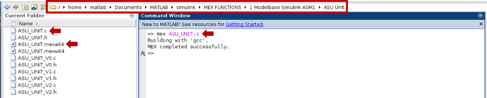

#### Run Simulink Project

- Once all the code has been successfully compiled the Simulink Project is executed with double clic in the `*.slx`. E.g.: `Remedy_WWTP.slx`.
  
  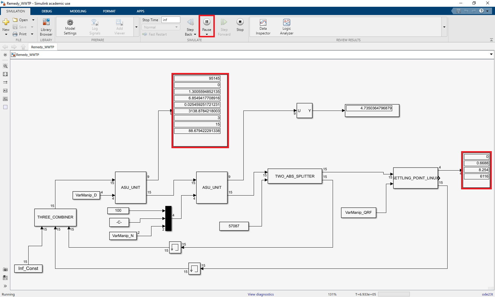

- The values displayed on the displays should be close to the values highlighted in the following figure.
  
  

### Getting started Scada-LTS

Open to see details

- Once Scada-LTS container is running:
  - Access to Scada-LTS GUI: [http://localhost:8080/Scada-LTS/](http://localhost:8080/Scada-LTS/).
  - Login with `username`: admin `password`: admin.
  - Create empty script in "Scripting".

      

  - Next go to the "SQL" tab.
  - Paste content scripts-one-insert.txt file into the text field "SQL".
  
  - File `scripts-one-insert.txt` is placed into `~/ICSVirtual/scada-lts/scripts`.
  - Click "Submit update"
  - If the operation is successful, the information about adding 12 records will be displayed.

      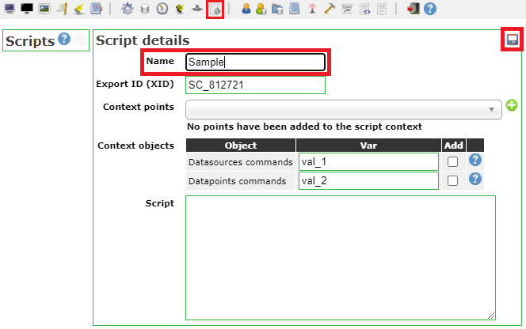
  
  - Then import the project (.json file).
    - E.g.: file `Water Heater 3 Stations.json` is placed into `~/ICSVirtual/scada-lts/sample/`

        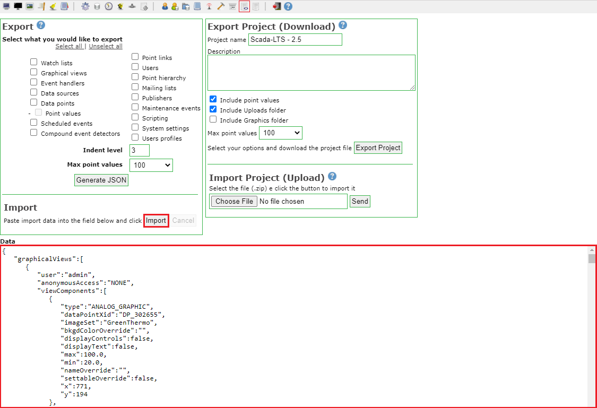

  - Add a data source running on port 502 with host:openplc.
  - Make the connection with OpenPLC.

      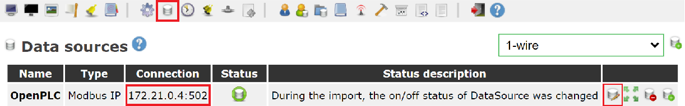

  - Add the background image at "Graphical views".
    - E.g.: file `background.png` is placed into `~/ICSVirtual/scada-lts/sample/`

        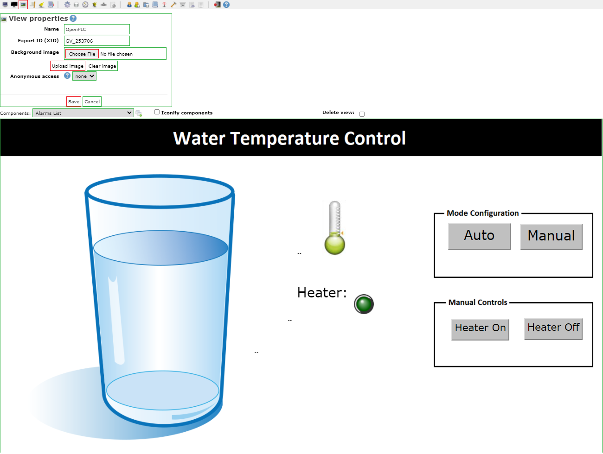
  - Change the name of the file named .env.example in /ICSVirtual/network/ICSNetwork :
  
    `cd ~/ICSVirtual/network/ICSNetwork`
    
    `mv .env.example .env`

#### Troubleshootings Scada-LTS

- [Graphical views Scada-LTS #1961](https://github.com/SCADA-LTS/Scada-LTS/issues/1961)

### Getting Started network ICSNetwork

Open to see details

- Add permissions
  - `cd ~/ICSVirtual/network/ICSNetwork`
  - `sudo chmod +x scripts/*.*`

### Getting Started Attacker

Open to see details

- **Attacker** is divided into: *Single Attacker* and *Modtester* tool.

#### Single Attacker

##### Create your own Attacker Docker image

- Go to attacker folder `cd ~/ICSVirtual/attacker`.
- Compile `injection_attack.cpp` file `g++ injection_attack.cpp -o injection_attack -pthread`.
- Build image: `docker build -t attacker .`.

##### Use the attacker image created for the project

- Open docker-compose file `cd ~/ICSVirtual/network/attacker`.
- Change the image of the `matlab` service by `sflorenz05/attacker:v0.1`.

##### Deploying Attacker

- Compile attacker code:
  - `cd ~/ICSVirtual/attacker`
  - `g++ injection_attack.cpp -o injection_attack -pthread`
- Add permissions:
  - `cd ~/ICSVirtual/network/attacker`
  - `sudo chmod +x scripts/*.*`
- Set enviromental variables:
  - Copy the `.env.example` and paste in the same path.
    - Rename `.env.example` to `.env`.
  - Inspect the PLC container: `docker inspect <containerid>` to recover IP address of this container.
    - Set the `IP_PLC` variable.
    - Set the `FREQ` variable.

#### ModTester

##### Create your own ModTester Docker image

- Go to modtester folder `cd ~/ICSVirtual/modtester`.
- Build image: `docker build -t modtester .`.

##### Use the modtester image created for the project

- Open docker-compose file `cd ~/ICSVirtual/network/modtester`.
- Change the image of the `matlab` service by `sflorenz05/modtester:v0.2`.

##### Deploying ModTester

- Add permissions:
  - `cd ~/ICSVirtual/network/modtester`
  - `sudo chmod +x scripts/*.*`

### Getting Started TCPDump

Open to see details

- To capture the traffic into the ICSNetwork the [TCPDump](https://www.tcpdump.org/) tool is used.
- To deploy as part of the Docker Infrastructure `kaazing/tcpdump` image is [used](https://hub.docker.com/r/kaazing/tcpdump).
- Once the `tcpdump` container is deployed an `*.pcap` file is included as part of the `tcpdump` folder.

  

- Once `*.pcap` file is downloaded, it can be opened using Wireshark.
  
  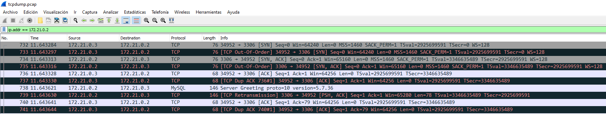
  

## How to use the project

### Deploy ICSNetwork

- `cd ~/ICSVirtual/network/ICSNetwork`

- `make start`

- `make stop`

- `make destroy`

### Deploy tcpdump

- `cd ~/ICSVirtual/network/tcpdump`

- `make start`

- `make stop`

- `make destroy`

### Deploy Attacker

#### Single Attacker

- `cd ~/ICSVirtual/network/attacker`

- `make start`

- `make stop`

- `make destroy`

#### ModTester

- `cd ~/ICSVirtual/network/modtester`

- `make start`

- `docker exec -it <modtester-container-id> bash`
  - E.g.: `docker exec -it 91d48b6bdabd bash`
  
- Inside the container execute:
  
  - `python modTester.py`
  
  - `show modules` / `use module_name`
    - E.g.: `use modbus/dos/floodingAttack`

  - `show options` to see options to complete.
    - E.g.: `set RHOSTS ip`  -->  `set RHOSTS 172.18.0.2`
    - E.g.: `set sIP ip`  -->  `set sIP 172.18.0.3`
  
  - `exploit`

- `make stop`

- `make destroy`

## How to test connection

- `docker inspect <containerid>`
  
- `docker exec -it <containerid> bash`
  
### Install/use ping network tool

- `sudo apt-get update`

- `sudo apt-get install iputils-ping`
  
- e.g.: `ping 192.168.144.3`
